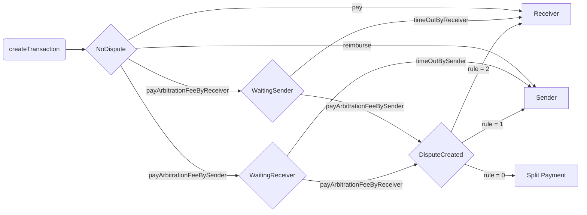

# Nerwo Platform: Smart contracts

## Overview

The `NerwoEscrow` contract facilitates secure transactions between a sender and a receiver.
The contract holds funds on behalf of the sender until the transaction is completed or a dispute arises.
In case of disputes, an external arbitrator resolves the issue and determines the outcome.

The main features of the contract include:

- Creating transactions
- Making payments
- Reimbursements
- Executing transactions
- Timeouts
- Raising disputes and handling arbitration fees
- Submitting evidence
- Arbitrator ruling

## Functions

### createTransaction

`createTransaction(address _token, uint256 _amount, address _receiver, string calldata _metaEvidence)`

Allows the sender to create a new transaction by providing the ERC20 token,
receiver's address, the transaction amount, and meta evidence uri.
The sender must have approved the amount the ERC20 token transfer.

### pay

`pay(uint256 _transactionID, uint256 _amount)`

Allows the sender to pay the receiver for the provided goods or services.
The function checks whether the caller is the transaction sender,
whether the transaction has a valid status,
and whether the amount is within the valid range before proceeding.

### reimburse

`reimburse(uint256 _transactionID, uint256 _amountReimbursed)`

Allows the receiver to reimburse the sender if the goods or services cannot be fully provided.
The function checks whether the caller is the transaction receiver,
whether the transaction has a valid status,
and whether the amount to be reimbursed is within the valid range before proceeding.

### timeOutBySender

`timeOutBySender(uint256 _transactionID)`

Allows the sender to request a ruling in their favor if the receiver fails
to pay the arbitration fee within the specified timeout.
The function checks whether the transaction has a valid status and whether
the timeout has been reached before proceeding.

### timeOutByReceiver

`timeOutByReceiver(uint256 _transactionID)`

Allows the receiver to request a ruling in their favor if the sender fails
to pay the arbitration fee within the specified timeout.
The function checks whether the transaction has a valid status and whether
the timeout has been reached before proceeding.

### payArbitrationFeeBySender

`payArbitrationFeeBySender(uint256 _transactionID)`

Allows the sender to pay the arbitration fee to raise a dispute.
The function verifies whether the caller is the transaction sender,
whether the transaction has a valid status, and whether
the correct arbitration fee has been paid before proceeding.

### payArbitrationFeeByReceiver

`payArbitrationFeeByReceiver(uint256 _transactionID)`

Allows the receiver to pay the arbitration fee to raise a dispute.
The function verifies whether the caller is the transaction receiver,
whether the transaction has a valid status, and whether
the correct arbitration fee has been paid before proceeding.

### _raiseDispute

`_raiseDispute(uint256 _transactionID, uint256 _arbitrationCost)`

Internal function to create a dispute and associate it with a transaction.
This function is called when both sender and receiver have paid their arbitration fees.

### submitEvidence

`submitEvidence(uint256 _transactionID, string calldata _evidence)`

Allows the sender or receiver to submit evidence for a dispute
by providing a link to the evidence using its URI.
The function checks whether the caller is either
the transaction sender or receiver and whether
the transaction has a valid status before proceeding.

### rule

`rule(uint256 _disputeID, uint256 _ruling)`

Allows the arbitrator to give a ruling for a dispute.
The function verifies whether the caller is the arbitrator,
whether the transaction has a valid status,
and whether the ruling is valid before proceeding.

### _executeRuling

`_executeRuling(uint256 _transactionID, uint256 _ruling)`

Internal function to execute a ruling of a dispute.
It reimburses the arbitration fee to the winning party and updates the transaction status accordingly.

## Events

### Payment

`event Payment(uint256 indexed _transactionID, address indexed _token, uint256 _amount, address indexed _sender);`

Emitted when a payment is made.
It provides the transaction ID, the ERC20 token address, the amount paid, and the address of the sender.

### HasToPayFee

`event HasToPayFee(uint256 indexed _transactionID, Party _party);`

Emitted when a party has to pay an arbitration fee.
It provides the transaction ID and the party that has to pay the fee.

### TransactionCreated

`event TransactionCreated(uint256 _transactionID, address indexed _sender, address indexed _receiver, address indexed _token, uint256 _amount);`

Emitted when a new transacction is created (the Escrow).
It provides all needed informations.

### FeeRecipientPayment

`event FeeRecipientPayment(uint256 indexed _transactionID, address indexed _token, uint256 _feeAmount);`

Emitted when a fee payment is made to the fee recipient.
It provides the transaction ID, the ERC20 token address and the fee amount.

### FeeRecipientChanged

`event FeeRecipientChanged(address indexed _oldFeeRecipient, address indexed _newFeeRecipient);`

Emitted when fee recipent is changed (admin function).
It provides the old and new fee recipient.

### MetaEvidence

`event MetaEvidence(uint256 indexed _metaEvidenceID, string _evidence);`

Emitted when a meta-evidence is submitted.
It provides the uri of meta-evidence.

### Dispute

`event Dispute(IArbitrator indexed _arbitrator, uint256 indexed _disputeID, uint256 _metaEvidenceID, uint256 _transactionID);`

Emitted when a dispute is created. It provides the arbitrator, the dispute ID,
the meta-evidence ID, and the transaction ID.

### Evidence

`event Evidence(IArbitrator indexed _arbitrator, uint256 indexed _transactionID, address indexed _party, string _evidence);`

Emitted when evidence is submitted for a dispute.
It provides the arbitrator, the transaction ID, the address of the party submitting the evidence,
and the link to the evidence.

### SendFailed

`event SendFailed(address indexed recipient, address indexed token, uint256 amount, bytes data);`

Emitted when sending funds fails. It the address of the ERC20 is 0
it refers to the native token (used for arbitration).

### FundsRecovered

`event FundsRecovered(address indexed recipient, uint256 amount);`

Emitted when the owner calls withdrawLostFunds to recover failed to send arbitration reimburses.

### Ruling

`event Ruling(IArbitrator indexed _arbitrator, uint256 indexed _disputeID, uint256 _ruling);`

Emitted when a ruling is given for a dispute.
It provides the arbitrator, the dispute ID, and the ruling.

## Custom Errors

### NullAddress

`error NullAddress();`

Thrown when a required address is instead null.

### NoTimeout

`error NoTimeout();`

Thrown when the function is called before the required timeout period has passed.

### InvalidRuling

`error InvalidRuling();`

Thrown when the arbitrator gives an invalid ruling.

### InvalidCaller

`error InvalidCaller(address expected);`

Thrown when the function caller is not the expected address.

### InvalidStatus

`error InvalidStatus(uint256 expected);`

Thrown when the function is called with an invalid transaction status.

### InvalidAmount

`error InvalidAmount(uint256 expected);`

Thrown when the function is called with an invalid amount.

### NoLostFunds

`error NoLostFunds();`

Thrown when are no lost funds to recover.

## Enumerations

### Status

`enum Status {NoDispute, WaitingSender, WaitingReceiver, DisputeCreated, Resolved}`

Represents the current status of a transaction:

- `NoDispute`: The transaction has no dispute.
- `WaitingSender`: The transaction is waiting for the sender to pay the arbitration fee.
- `WaitingReceiver`: The transaction is waiting for the receiver to pay the arbitration fee.
- `DisputeCreated`: A dispute has been created for the transaction.
- `Resolved`: The transaction has been resolved, either by a ruling or by the parties coming to an agreement.

### Party

`enum Party {Sender, Receiver}`

Represents the parties involved in a transaction:

- `Sender`: The party sending the payment.
- `Receiver`: The party receiving the payment.

This contract allows two parties, a sender and a receiver,
to engage in transactions with the possibility of
raising disputes and having them resolved by an arbitrator.
The contract handles payments, fee calculations, dispute creation, and evidence submission.
In the case of a dispute, the arbitrator is responsible for providing a ruling,
which will result in either the sender being reimbursed or the receiver being paid.
The contract also enforces timeouts for various actions,
such as paying arbitration fees and executing transactions.

### Escrow flow

