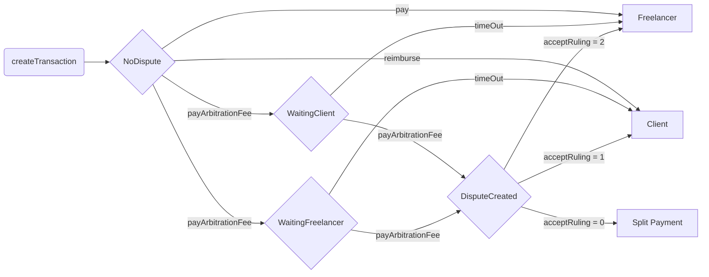

# Nerwo Platform: Smart contracts

## Overview

The `NerwoEscrow` contract facilitates secure transactions between a client and a freelancerr.
The contract holds funds on behalf of the client until the transaction is completed or a dispute arises.
In case of disputes, an external arbitrator resolves the issue and determines the outcome.

The main features of the contract include:

- Creating escrow
- Making payments
- Reimbursements
- Raising disputes
- Ruling

## Functions

### createTransaction

`createTransaction(IERC20 token, uint256 amount, address freelancer, string calldata _metaEvidence)`

Allows the client to create a new transaction by providing the ERC20 token,
freelancer's address, the transaction amount.
The client must have approved the amount the ERC20 token transfer.

### pay

`pay(uint256 transactionID, uint256 amount)`

Allows the client to pay the freelancer for the provided goods or services.
The function checks whether the caller is the transaction client,
whether the transaction has a valid status,
and whether the amount is within the valid range before proceeding.

### reimburse

`reimburse(uint256 transactionID, uint256 amountReimbursed)`

Allows the freelancer to reimburse the client if the goods or services cannot be fully provided.
The function checks whether the caller is the transaction freelancer,
whether the transaction has a valid status,
and whether the amount to be reimbursed is within the valid range before proceeding.

`payArbitrationFee(uint256 transactionID)`

Allows the client or the freelancer to pay the arbitration fee to raise a dispute.
The function verifies whether the caller is the transaction client or freelancer,
whether the transaction has a valid status, and whether
the correct arbitration fee has been paid before proceeding.

### timeOut

`timeOut(uint256 transactionID)`

Allows the client or the freelancer to request a ruling in their favor if the other party fails
to pay the arbitration fee within the specified timeout.
The function checks whether the transaction has a valid status and whether
the timeout has been reached before proceeding.

### _raiseDispute

`_raiseDispute(uint256 transactionID, uint256 arbitrationCost)`

Internal function to create a dispute and associate it with a transaction.
This function is called when both client and freelancer have paid their arbitration fees.

### acceptRuling

`function acceptRuling(uint256 transactionID) external`

Accept ruling for a dispute.

### _executeRuling

`_executeRuling(uint256 transactionID, uint256 ruling)`

Internal function to execute a ruling of a dispute.
It reimburses the arbitration fee to the winning party and updates the transaction status accordingly.

### getTransaction

`getTransaction(uint256 transactionID)`

External function helper for frontend calls, it returns the transaction
or raises an error if the transaction does not exist.

### getSupportedTokens

`function getSupportedTokens() external view returns (IERC20[] memory)`

Get supported ERC20 tokens.

### getArbitrationCost

`function getArbitrationCost() external view returns (uint256)`

Ask arbitrator for abitration cost.

### fetchRuling

`function fetchRuling(uint256 transactionID) external view`

Get the ruling for the dispute of given transaction.

## Events

### Payment

`event Payment(uint256 indexed transactionID, IERC20 indexed token, uint256 amount, address indexed client)`

Emitted when a payment is made.
It provides the transaction ID, the ERC20 token address, the amount paid, and the address of the client.

### HasToPayFee

`event HasToPayFee(uint256 indexed transactionID, address party)`

Emitted when a party has to pay an arbitration fee.
It provides the transaction ID and the party that has to pay the fee.

### TransactionCreated

`event TransactionCreated(uint256 transactionID, address indexed client, address indexed freelancer, IERC20 indexed token, uint256 amount)`

Emitted when a new transaction is created (the Escrow).
It provides all needed informations.

### FeeRecipientPayment

`event FeeRecipientPayment(uint256 indexed transactionID, IERC20 indexed token, uint256 feeAmount)`

Emitted when a fee payment is made to the fee recipient.
It provides the transaction ID, the ERC20 token address and the fee amount.

### FeeRecipientChanged

`event FeeRecipientChanged(address indexed oldFeeRecipient, address indexed newFeeRecipient)`

Emitted when fee recipent is changed (admin function).
It provides the old and new fee recipient.

### SendFailed

`event SendFailed(address indexed recipient, address indexed token, uint256 amount, bytes data)`

Emitted when sending funds fails. It the address of the ERC20 is 0
it refers to the native token (used for arbitration).

## Custom Errors

### NullAddress

`error NullAddress()`

Emitted when a required address is instead null.

### NoTimeout

`error NoTimeout()`

Emitted when a timeOut operation is attempted before the feeTimeout period has elapsed.

### InvalidCaller

`error InvalidCaller()`

Emitted when the function caller is not the expected one.

### InvalidStatus

`error InvalidStatus()`

Emitted when the status of a transaction does not allow a certain operation to be performed.

### InvalidAmount

`error InvalidAmount()`

Emitted when the function is called with an invalid amount.

### InvalidTransaction

`error InvalidTransaction()`

Emitted when the requested transactionID does not refer to a valid transaction.

### InvalidToken

`error InvalidToken()`

### InvalidFeeBasisPoint

`error InvalidFeeBasisPoint()`

### NotRuled

`error NotRuled()`

Emitted when a ruling is queried or attempted to be executed for a dispute that has not yet been ruled

## Enumerations

### Status

`enum Status {NoDispute, Waitingclient, Waitingfreelancer, DisputeCreated, Resolved}`

Represents the current status of a transaction:

- `NoDispute`: The transaction has no dispute.
- `WaitingClient`: The transaction is waiting for the client to pay the arbitration fee.
- `WaitingFreelancer`: The transaction is waiting for the freelancer to pay the arbitration fee.
- `DisputeCreated`: A dispute has been created for the transaction.
- `Resolved`: The transaction has been resolved, either by a ruling or by the parties coming to an agreement.

### Parties

The arties involved in a transaction are:

- `client`: The party sending the payment.
- `freelancer`: The party receiving the payment.

This contract allows two parties, a client and a freelancer,
to engage in transactions with the possibility of
raising disputes and having them resolved by an arbitrator.
The contract handles payments, fee calculations, dispute creation, and evidence submission.
In the case of a dispute, the arbitrator is responsible for providing a ruling,
which will result in either the client being reimbursed or the freelancer being paid.
The contract also enforces timeouts for various actions,
such as paying arbitration fees and executing transactions.

### Escrow flow

